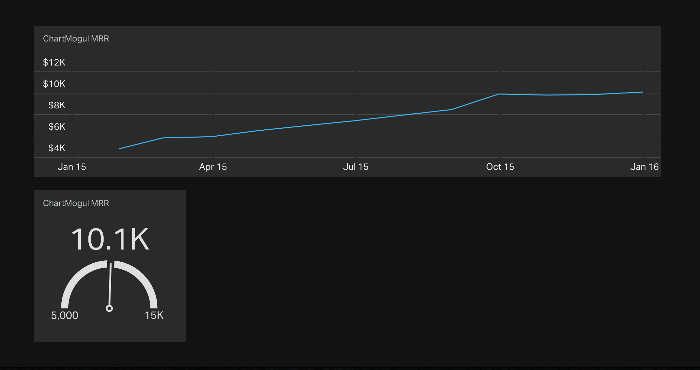

# chartmogul-geckoboard

A simple ChartMogul - Geckoboard integration written in Node.js 



## Instructions for running locally

To modify the integration locally and see the changes reflected immediately within Geckoboard, follow these instructions.

### Prerequisites

- Node.js

### Run locally

1. Clone this repository and cd into it

    ```bash
    git clone git@github.com:bilbof/chartmogul-geckoboard
    cd chartmogul-geckoboard
    ```

2. Add your ChartMogul and Geckoboard API keys to app.js

  Open app.js, and add your `chartmogulApiToken` & `chartmogulSecretKey` found at [https://app.chartmogul.com/#admin/api](https://app.chartmogul.com/#admin/api) (admin permissions required).
  
  Next, add your `geckoKey`. You can find this at [https://cmdev.geckoboard.com/account/details](https://cmdev.geckoboard.com/account/details).
  
3. Create two custom widgets in your Geckoboard

  a) Add a custom line chart to your Geckoboard dashboard
  
    Important: Select 'Push' as the Method.
    
    Add the `widgetKey` provided to line 25 of app.js. Make any additional changes to the chart settings from line 19 in app.js.
  
  ```JavaScript
  var lineGraph = {
  	enabled: true, // turn this on or off with (true) or (false).
  	metric: 'mrr', // see the Metrics API documentation for more options: https://github.com/chartmogul/metrics-api
  	startDate: '2015-01-01', // start date of the line graph
  	endDate: '2015-12-31', // end date of the line graph
  	interval: 'month', // available options: day, week, month, quarter, year (depends on the metric, see the Metrics API documentation)
  	widgetKey: 'your_geckoboard_line_graph_widget_key'
  }
  ```
  
  b) Add a custom Geck-O-Meter to your Geckoboard dashboard
    Important: Select 'Push' as the Method.
    
    Add the `widgetKey` provided to line 35 of app.js. Make any additional changes to the Geck-O-Meter settings from line 29 in app.js.

  ```JavaScript
    var geckoMeter = {
  	enabled: true, // turn this on or off with (true) or (false).
  	metric: 'mrr', // see the Metrics API documentation for more options: https://github.com/chartmogul/metrics-api
  	startDate: '2015-01-01',
  	endDate: '2015-12-31', // use the current date here.
  	interval: 'month',
  	widgetKey: 'your_geckoboard_line_graph_widget_key',
  	min: '5000', // the minimum value of your GeckoMeter
  	max: '15000' // the maximum value of your GeckoMeter
  }
  ```
  
4. Run app.js.
  
    ```bash
    node app.js
    ```

Further instructions can be found in the [Geckoboard documentation](https://developer.geckoboard.com/) and the ChartMogul [Metrics API documentation](https://github.com/chartmogul/metrics-api/blob/master/API-Documentation/api.md).